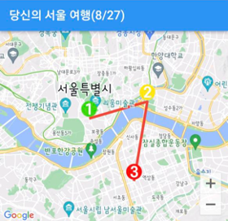
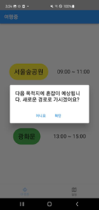
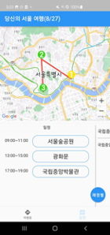

<!-- Improved compatibility of back to top link: See: https://github.com/othneildrew/Best-README-Template/pull/73 -->

<!-- PROJECT LOGO -->
 

  

<h3 align="center">SeouL Ro</h3>

  

    2022 Seoul IoT Hackathon mobile application project
     
    <a href="https://github.com/SeoulRo/SeoulRo"><strong>Explore the docs »</strong></a>
     
    <a href="https://github.com/SeoulRo/SeoulRo/issues">Request Feature</a>
  

<!-- TABLE OF CONTENTS -->

  
Table of Contents

  <ol>
	<li><a href="#award">Award</a></li>
    <li>
      <a href="#about-the-project">About The Project</a>
      <ul>
        <li><a href="#built-with">Built With</a></li>
      </ul>
    </li>
    <li><a href="#usage">Usage</a></li>
    <li><a href="#license">License</a></li>
    <li><a href="#contact">Contact</a></li>
  </ol>

## Award

<!-- ABOUT THE PROJECT -->

## About The Project

2022 서울 IoT 해커톤 제출 작품 "SeouL Ro" 모바일 어플리케이션입니다.  
서울을 여행하는 여행객에게 실시간으로 지역별 유동인구를 파악하여 혼잡하지 않은 여행 경로를 제안합니다.  
사용자는 여행중 실시간으로 어플리케이션을 통해 최적 경로 제안 알림을 받습니다.

(<a href="#readme-top">back to top</a>)

### Built With

- Flutter SDK
- Seoul IoT floating population data
- Google Maps SDK

(<a href="#readme-top">back to top</a>)

<!-- USAGE EXAMPLES -->
## Usage
### 여행경로 표시
  
### 일정변경 제안
  
### 변경된 경로 비교 / 변경된 경로 표시

  
### 실시간 여행경로변경 제안 / 여행경로 추가 및 표시

  

(<a href="#readme-top">back to top</a>)

(<a href="#readme-top">back to top</a>)

<!-- LICENSE -->
## License

Distributed under the MIT License. See `LICENSE` for more information.

(<a href="#readme-top">back to top</a>)

<!-- CONTACT -->
## Contact
https://github.com/KyooSikLee  
https://github.com/minusmo

(<a href="#readme-top">back to top</a>)

