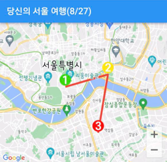

# 🗺️ SeouL Ro — ソウル観光リアルタイム最適化アプリ

[🇺🇸 English](./README.md)

## 🏆 受賞

2022 年 ソウル公共 IoT ハッカソン 受賞作品

## 🧭 プロジェクト概要

ソウルを訪れる外国人観光客の旅を IT 技術でより快適に。  
リアルタイム人口密度データを活用し、混雑を回避した最適な観光ルートを提供するモバイルアプリケーションです。

- ユーザーは事前に旅行計画を登録
- アプリがリアルタイム人口密度に応じてルートを自動再編成
- アルゴリズムにより旅行動線を変更
- Flutter × FastAPI × AWS 上で構成されたサービス

---

## 📐 詳細と構成技術

### 🎯 プロジェクトの目的

- ソウル市は大都市で、観光名所に狭い路地も多く存在します
- 混雑による不快感や安全リスクを軽減するために、このプロジェクトが発足しました

### 💻 技術スタック

| 項目           | 技術                                        |
| -------------- | ------------------------------------------- |
| モバイルアプリ | Flutter / Dart                              |
| バックエンド   | FastAPI (Python)                            |
| デプロイ       | AWS EC2                                     |
| その他         | GitHub Actions / Population Public Open API |

### 使用技術

---

## 🧠 課題と解決策

- 当初、ソウル市の「リアルタイム人口密度データ」を使用予定だったが、実際には時間帯・地域別の「人口数」データしか提供されていなかった
- チームは約 1 年分のデータを収集・加工して、リアルタイム人口密度に最も近い形式に変換
- 独自にサーバー上でリアルタイムで照会可能な仕組みを構築
- アルゴリズムには、加重値（人口密度）付きの BFS を応用し、リアルタイムに最短経路を再計算

---

## 🗺️ ハイレベルアーキテクチャ

---

## 📱 アプリ画面例（使用方法）

### ✅ 旅行ルート表示

### 🔄 スケジュール変更提案

### 📌 変更されたルートの比較・表示

### 🚦 リアルタイム提案・経路追加

---

## 🧪 学んだこと・振り返り

このプロジェクトを通じて以下を経験しました：

- 公共データの限界と解決のためのデータ整形技術
- IoT や人口情報を活用した実装
- 問題を発見し、エンジニアとしてそれを解決する姿勢
- ユーザー体験をリアルタイムに改善する手法

---

## 🔗 プロジェクトリンク

- GitHub リポジトリ: [https://github.com/SeoulRo/SeoulRo](https://github.com/SeoulRo/SeoulRo)

## 📜 ライセンス

MIT License

## 👤 作者・連絡先

- [minusmo (HoJoon Eum)](https://github.com/minusmo)
- [KyooSikLee](https://github.com/KyooSikLee)
